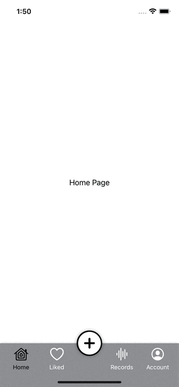

# SwiftUI - CustomTabBar
<br />
<p align="center">
  <a>
    
  </a>
</p>

CustomTabBar provide user to customize their button tabview with one additional button to expand the menu.

## Features

- [x] Implement router to navigate between each views.
- [x] Center button let the to customize their own button and action. 


## Requirements

- iOS 13.0+
- SwiftUI

## Installation

Clone the project and run in your local workstation. 

## Usage example

Within ContentView.swift, modify each case view to customize the user's own view.

ViewRouter is an enum with 4 cases (home, liked, records & user)
Under each view, user replace their own view within the block.

```swift
switch viewRouter.currentPage {
    case .home:
        VStack(spacing: 10){
            Text("Home Page")
        }
    case .liked:
        VStack(spacing: 10){

            Text("Liked Page")
        }
    case .records:
        VStack(spacing: 10){
            Text("Records Page")
        }
    case .user:
        VStack(spacing: 10){
            Text("User Page")
        }
}
```
Within ViewRouter.swift, you can define the each page as you wish. And setup the initial page in the ViewRouter class.

```swift
enum Page {
     case home
     case liked
     case records
     case user
 }

class ViewRouter: ObservableObject {
     
     @Published var currentPage: Page = .home
     
 }
 ```

## Contact
Created by [@Hung-Chun, Tsai (Carter)](linkedin.com/in/hung-chun-carter-tsai-372584175) - feel free to contact me!

<div>

<i>Follow me around the web:</i><br>

<!-- <a target="_blank" href="https://www.linkedin.com/in/hung-chun-carter-tsai-372584175/">🇱​🇮​🇳​🇰​🇪​🇩​🇮​🇳​</a> ●
<a target="_blank" href="https://www.instagram.com/hungchun.tsai/">🇮​🇳​🇸​🇹​🇦​🇬​🇷​🇦​🇲​</a> ●
<a target="_blank" href="https://www.facebook.com/hongjun.cai.5">🇫​🇦​🇨​🇪​🇧​🇴​🇴​🇰​</a> ● -->

<a href="https://www.linkedin.com/in/hung-chun-carter-tsai-372584175/" target="_blank"></a>
<a href="https://www.instagram.com/hungchun.tsai/" target="_blank"></a>
<a href="https://www.facebook.com/hongjun.cai.5" target="_blank"></a>

</div>

